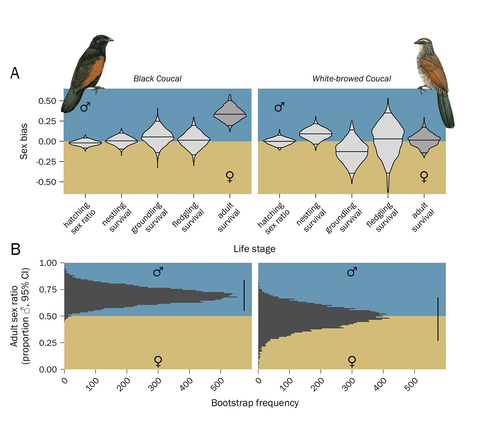

# Reproducible datasets and code for:

## Early-life demographic processes do not drive adult sex ratio biases and mating systems in sympatric coucal species

### *Submitted* for peer-review

#### Luke Eberhart-Hertel1,2,\*, Ignas Safari3,4,5\*, Poyo Makomba4, Anne Hertel6, and Wolfgang Goymann3,4,6

\* joint first-authors

1)  *Max Planck Institute for Biological Intelligence, Behavioural
    Genetics and Evolutionary Ecology, Eberhard-Gwinner-Straße 5, 82319
    Seewiesen, Germany*
2)  *Max Planck Institute for Biological Intelligence, Department of
    Ornithology, Eberhard-Gwinner-Straße 7/8, 82319 Seewiesen, Germany*
3)  *Max Planck Institute for Biological Intelligence, Department
    Behavioural Neurobiology, Eberhard-Gwinner-Straße 6a, 82319
    Seewiesen, Germany*
4)  *Coucal Project, P.O. Box 26, Chimala, Tanzania*
5)  *Department of Biology, College of Natural and Mathematical
    Sciences, University of Dodoma, P.O. Box 338, Dodoma, Tanzania*
6)  *Ludwig Maximilians University Munich, Department Biology II,
    Großhaderner Str. 2, 82152 Martinsried, Germany*

✉ For correspondence regarding the code in this repository, please
contact: Luke
(<a href= "mailto:luke.eberhart[at]bi.mpg.de">luke.eberhart[at]bi.mpg.de</a>)

✉ For correspondence regarding the data and study system, please
contact: Wolfgang
(<a href= "mailto:wgoymann@bi.mpg.de">wgoymann[at]bi.mpg.de</a>) or
Safari
(<a href= "mailto:safariignas@yahoo.co.uk">safariignas[at]yahoo.co.uk</a>)

In this repository you can find all the raw data and code needed to
reproduce our investigation of sex-specific early-life demographic
pathways of black coucals (*Centropus grillii*) and white-browed coucals
(*Centropus superciliosus*) monitored over a 15-year period in
south-western Tanzania.

#### Repository Contents

-   [`Supplementary_Material_A.qmd`](https://github.com/leberhartphillips/coucal_demography/blob/main/R/Supplementary_Material_A.qmd)
    Quarto source code for vignette of analysis
-   [`Supplementary_Material_A.html`](https://github.com/leberhartphillips/coucal_demography/blob/main/R/Supplementary_Material_A.html)
    HTML vignette of analysis for reproducibility of results

[**`data/raw/`**](https://github.com/leberhartphillips/coucal_demography/tree/main/data)

-   [`Coucal_chick_survival_2001-2019_20200129.csv`](https://github.com/leberhartphillips/coucal_demography/tree/main/output/bootstraps/raw/Coucal_chick_survival_2001-2019_20200129.csv)
-   [`All_coucal_waypoints_2001_2019_20200202.xlsx`](https://github.com/leberhartphillips/coucal_demography/tree/main/output/bootstraps/raw/All_coucal_waypoints_2001_2019_20200202.xlsx)
-   [`Coucal_Nr_mates_2001_2019_20200123.csv`](https://github.com/leberhartphillips/coucal_demography/tree/main/output/bootstraps/raw/Coucal_Nr_mates_2001_2019_20200123.csv)
-   [`Egg_surv_data_2001_2019_20210524.xls`](https://github.com/leberhartphillips/coucal_demography/tree/main/output/bootstraps/raw/Egg_surv_data_2001_2019_20210524.xls%60)
-   [`coucals_first_flights_data_per_individual2020.csv`](https://github.com/leberhartphillips/coucal_demography/tree/main/output/bootstraps/raw/coucals_first_flights_data_per_individual2020.csv)
-   [`juvies_2013_2020_waypoints.csv`](https://github.com/leberhartphillips/coucal_demography/tree/main/output/bootstraps/raw/juvies_2013_2020_waypoints.csv)
-   [`Coucal_adults_survival_2001-2019_20200129.csv`](https://github.com/leberhartphillips/coucal_demography/tree/main/output/bootstraps/raw/Coucal_adults_survival_2001-2019_20200129.csv)
-   [`age_classes_2001-2020_2.xlsx`](https://github.com/leberhartphillips/coucal_demography/tree/main/output/bootstraps/raw/age_classes_2001-2020_2.xlsx)

[**`outout/bootstraps/raw/`**](https://github.com/leberhartphillips/coucal_demography/tree/main/output/bootstraps/raw/)
folder containing all the raw runs of the stochastic simulation (10000
rds files for each species) and the adult CJS bootstrap (10000 rds
files)

-   10000 rds files for black coucal hazard and ASR model (e.g.,
    [`BC_boot_w_trans_WBC_ad_surv_stoc_5802.Rds`](https://github.com/leberhartphillips/coucal_demography/tree/main/output/bootstraps/raw/BC_boot_w_trans_WBC_ad_surv_stoc_5802.Rds))
-   10000 rds files for white-browed coucal hazard and ASR model (e.g.,
    [`WBC_boot_w_trans_WBC_ad_surv_stoc_5802.Rds`](https://github.com/leberhartphillips/coucal_demography/tree/main/output/bootstraps/raw/WBC_boot_w_trans_WBC_ad_surv_stoc_5802.Rds))
-   10000 rds files for white-browed coucal CJS adult survival bootstrap
    (e.g.,
    [`WBC_boot_CJS_5802.Rds`](https://github.com/leberhartphillips/coucal_demography/tree/main/output/bootstraps/raw/WBC_boot_w_trans_WBC_ad_surv_stoc_5802.Rds))

[**`output/bootstraps/tidy/`**](https://github.com/leberhartphillips/coucal_demography/tree/main/output/bootstraps/tidy)
folder containing the tidy summaries of the stochastic simulation

-   [`BC_haz_sur_ASR_boot_tidy_stoc_trans.rds`](https://github.com/leberhartphillips/coucal_demography/tree/main/output/bootstraps/tidy/BC_haz_sur_ASR_boot_tidy_stoc_trans.rds)
-   [`BC_hazard_ASR_bootstrap_result_w_trans_WBC_ad_surv_stoc.rds`](https://github.com/leberhartphillips/coucal_demography/tree/main/output/bootstraps/tidy/BC_hazard_ASR_bootstrap_result_w_trans_WBC_ad_surv_stoc.rds)
-   [`WBC_haz_sur_ASR_boot_tidy_stoc.rds`](https://github.com/leberhartphillips/coucal_demography/tree/main/output/bootstraps/tidy/WBC_haz_sur_ASR_boot_tidy_stoc.rds)
-   [`WBC_adult_survival_CJS_bootstrap_tidy.rds`](https://github.com/leberhartphillips/coucal_demography/tree/main/output/bootstraps/tidy/WBC_adult_survival_CJS_bootstrap_tidy.rds)
-   [`WBC_hazard_ASR_bootstrap_result_w_WBC_ad_surv_stoc.rds`](https://github.com/leberhartphillips/coucal_demography/tree/main/output/bootstraps/tidy/WBC_hazard_ASR_bootstrap_result_w_trans_WBC_ad_surv_stoc.rds)
-   [`parameter_distributions.rds`](https://github.com/leberhartphillips/coucal_demography/tree/main/output/bootstraps/tidy/parameter_distributions.rds)

[**`output/sensitivity_analysis/`**](https://github.com/leberhartphillips/coucal_demography/tree/main/output/bootstraps/sensitivity_analysis)
folder containing the output of the sensitivity analysis

-   [`BC_treat_sensitivity_analysis_ASR.rds`](https://github.com/leberhartphillips/coucal_demography/tree/main/output/bootstraps/sensitivity_analysis/BC_treat_sensitivity_analysis_ASR.rds)
    sensitivities of treatment life table for black coucal
-   [`BC_Mprime_sensitivity_analysis_male_ASR.rds`](https://github.com/leberhartphillips/coucal_demography/tree/main/output/bootstraps/sensitivity_analysis/BC_Mprime_sensitivity_analysis_male_ASR.rds)
    sensitivities of male-based M-prime life table for black coucal
-   [`BC_Mprime_sensitivity_analysis_female_ASR.rds`](https://github.com/leberhartphillips/coucal_demography/tree/main/output/bootstraps/sensitivity_analysis/BC_Mprime_sensitivity_analysis_female_ASR.rds)
    sensitivities of female-based M-prime life table for black coucal
-   [`WBC_treat_sensitivity_analysis_ASR.rds`](https://github.com/leberhartphillips/coucal_demography/tree/main/output/bootstraps/sensitivity_analysis/WBC_treat_sensitivity_analysis_ASR.rds)
    sensitivities of treatment life table for white-browed coucal
-   [`WBC_Mprime_sensitivity_analysis_male_ASR.rds`](https://github.com/leberhartphillips/coucal_demography/tree/main/output/bootstraps/sensitivity_analysis/WBC_Mprime_sensitivity_analysis_male_ASR.rds)
    sensitivities of male-based M-prime life table for white-browed
    coucal
-   [`WBC_Mprime_sensitivity_analysis_female_ASR.rds`](https://github.com/leberhartphillips/coucal_demography/tree/main/output/bootstraps/sensitivity_analysis/WBC_Mprime_sensitivity_analysis_female_ASR.rds)
    sensitivities of female-based M-prime life table for white-browed
    coucal

[**`output/mod_stats/`**](https://github.com/leberhartphillips/coucal_demography/tree/main/output/mod_stats)
folder containing the output of the age at fledge or flight mixed models
(e.g., parametric bootstrapping via partR2, rptR, etc.)

-   [`Stats_mod_fledge_age_BC.rds`](https://github.com/leberhartphillips/coucal_demography/tree/main/output/mod_stats/Stats_mod_fledge_age_BC.rds)
-   [`Stats_mod_fledge_age_WBC.rds`](https://github.com/leberhartphillips/coucal_demography/tree/main/output/mod_stats/Stats_mod_fledge_age_WBC.rds)
-   [`Stats_mod_flight_age_BC.rds`](https://github.com/leberhartphillips/coucal_demography/tree/main/output/mod_stats/Stats_mod_flight_age_BC.rds)
-   [`Stats_mod_flight_age_WBC.rds`](https://github.com/leberhartphillips/coucal_demography/tree/main/output/mod_stats/Stats_mod_flight_age_WBC.rds)

[**`images/`**](https://github.com/leberhartphillips/coucal_demography/tree/main/images)
folder containing the graphic in the Readme
